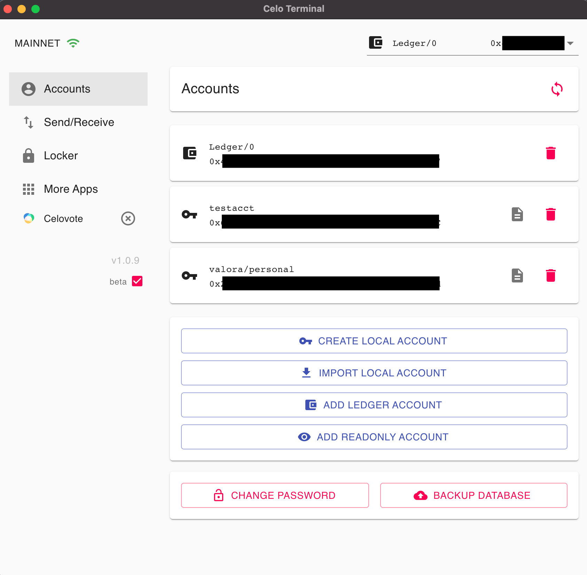
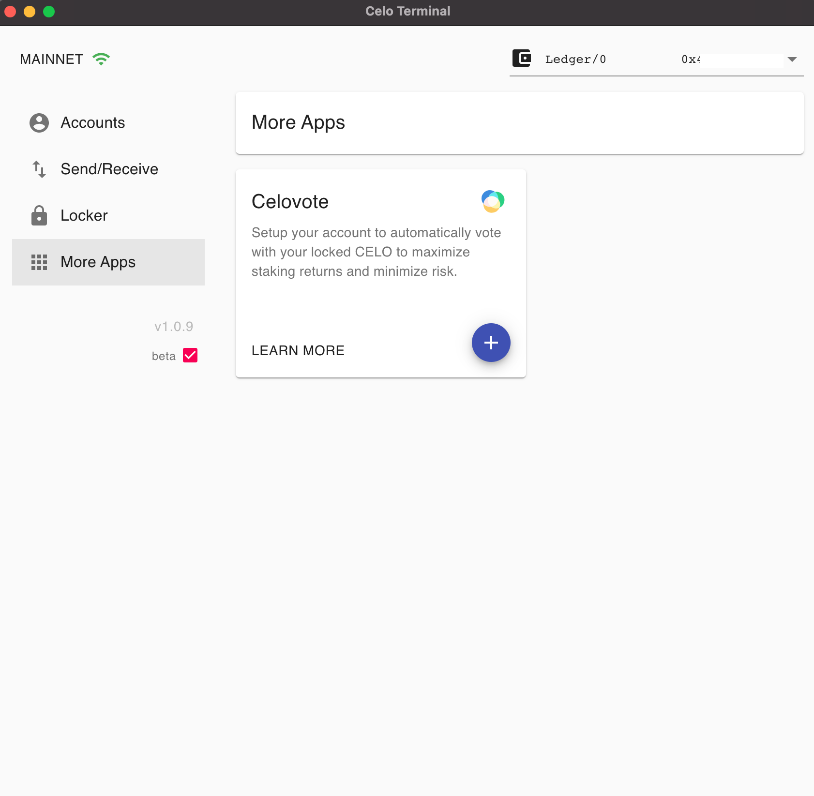
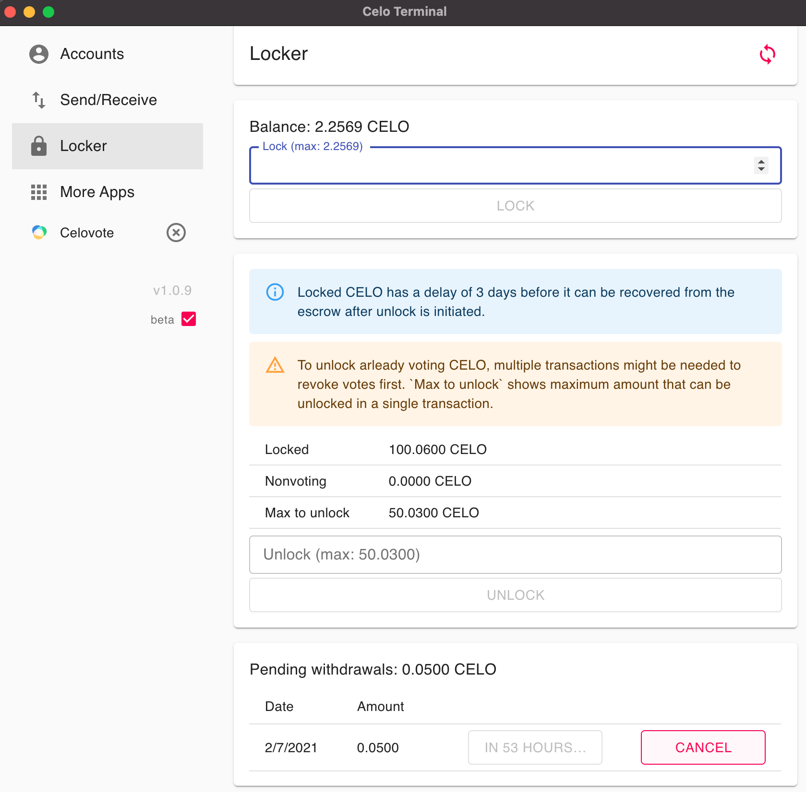
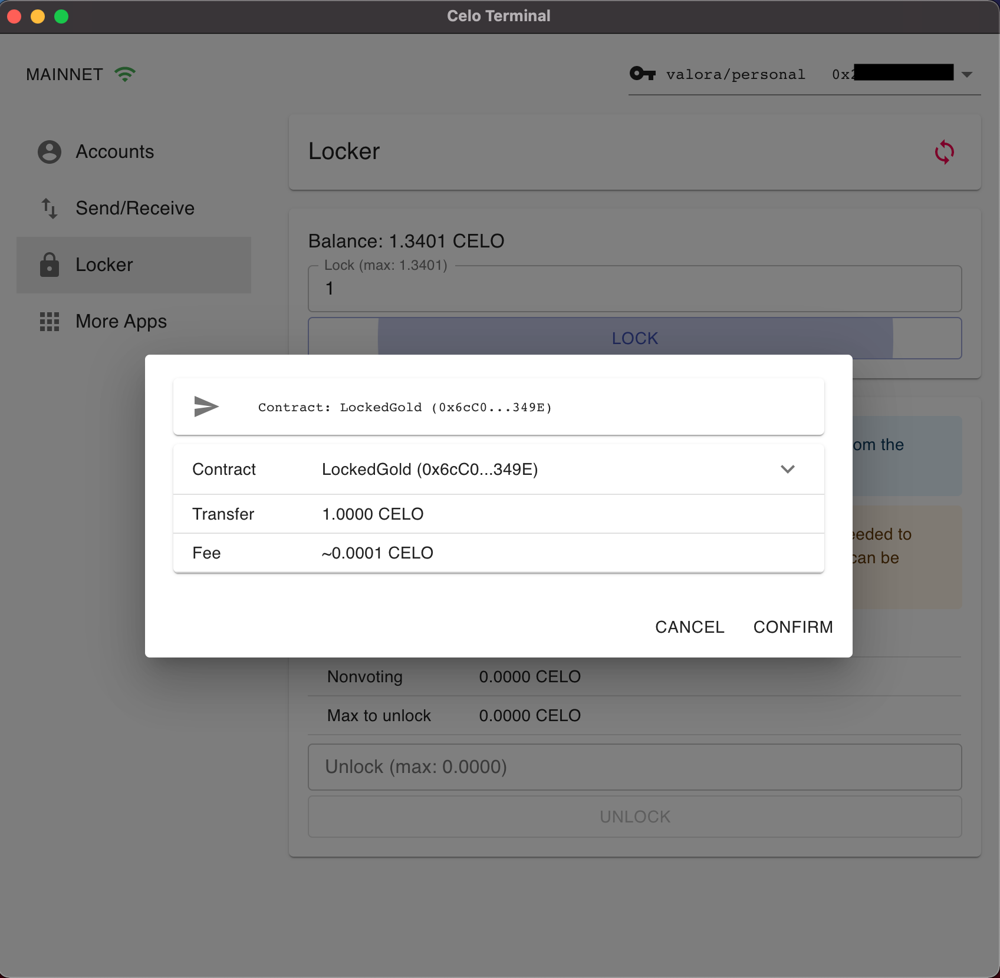

# Celo Terminal

Desktop app to manage accounts and interact with the decentralized apps on the Celo blockchain.

MacOS and (Windows: coming soon) versions available:
* https://github.com/zviadm/celoterminal/releases/latest

|  |  |
|:---:|:---:|
|  |  |
|:---:|:---:|

## App Framework

Celo Terminal is not just a wallet. Celo Terminal is an extensible platform to build secure and easy to use DApp UIs.
It simplifies the development process for the builders and improves usability for the users. If you are building a
smart-contract based protocol or a system on top of the Celo platform, check out how you can build your UI on top of
Celo Terminal [here](./docs/building-apps.md).

## Security & Privacy

Celo Terminal is built from the start with an emphasis on security and privacy. At its core, Celo Terminal only interacts
with the blockchain node. It doesn't collect any analytics, and it doesn't even send out any debug logs. While Celo Terminal
provides support for the built-in software upgrades, it never installs those upgrades without explicit user action.

Non-core DApps might require interacting with external servers other than the blockchain node, but
those interactions only happen when DApp is in active use. As Celo Terminal evolves, it will provide clearer
guidelines and indicators when any of the DApps interact with the external servers.
